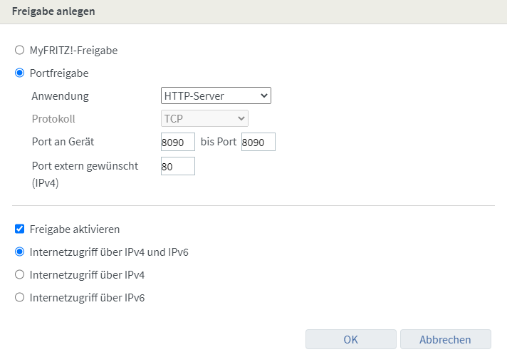

## Enable Port-Forwarding (using MyFritz)

Forward port 80 (external) to port 8090 (internal):

## Installing and running letsencrypt

$ git clone https://github.com/letsencrypt/letsencrypt  
$ ./letsencrypt-auto certonly --manual --email <YOUR_EMAIL> -d \<URL\>  

Results in something like:

> Create a file containing just this data:  
> 
> \<CONTENT\>  
> 
> And make it available on your web server at this URL:  
> 
> http://\<URL\>/.well-known/acme-challenge/\<FILENAME\>

At this point, don't press Enter, but continue with next step in another terminal.

## Running authenticator

1. $ docker build -t letsencrypt-authenticator .  
2. $ docker run -d -p 8090:8090 --name letsencrypt-authenticator letsencrypt-authenticator  

3. $ docker exec -it letsencrypt-authenticator sh  

  $ mkdir -p .well-known/acme-challenge  
  $ echo "\<CONTENT\>" > .well-known/acme-challenge/\<FILENAME\>  
  $ exit  

4. Call http://\<URL\>/.well-known/acme-challenge/\<FILENAME\> to make sure that the file can be reached from outside.

## Finalizing letsencrypt

If the generation of the certificate succeeded, you will be shown something like

> Congratulations! Your certificate and chain have been saved at:  
> /etc/letsencrypt/live/\<URL\>/fullchain.pem  
> Your key file has been saved at:  
> /etc/letsencrypt/live/\<URL\>/privkey.pem

Copy the generated privkey and cert:

$ sudo -i  
$ cd smart-home-connx  
$ cp /etc/letsencrypt/live/\<URL\>/cert.pem ./ssh  
$ cp /etc/letsencrypt/live/\<URL\>/privkey.pem ./ssh  
$ cp /etc/letsencrypt/live/\<URL\>/chain.pem ./ssh  
$ cp /etc/letsencrypt/live/\<URL\>/fullchain.pem ./ssh  
$ exit  
$ sudo chown -R pi:pi ssh/

## Clean up

$ docker stop letsencrypt-authenticator  

Disable port forwarding in your routers config!